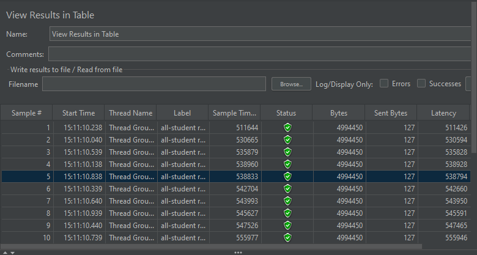
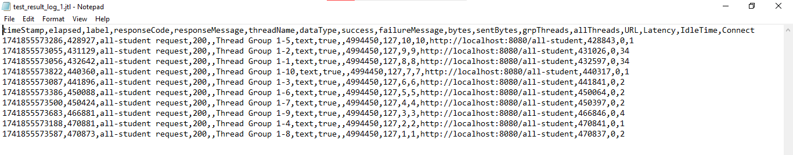
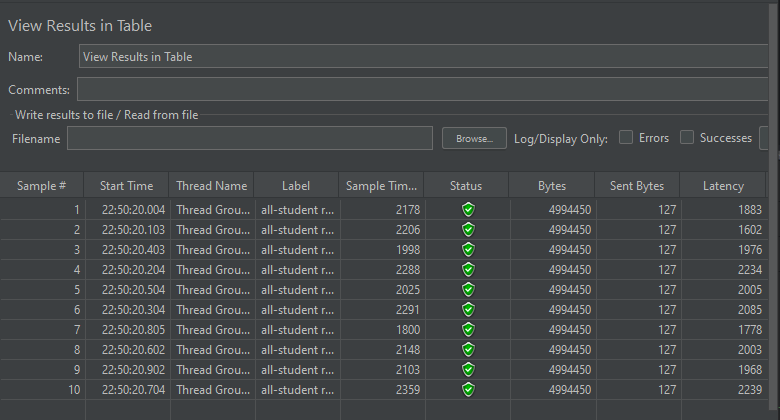
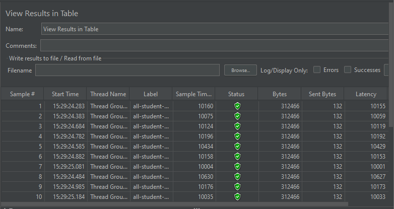
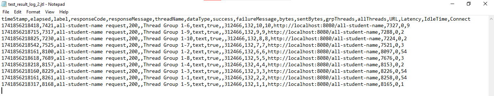
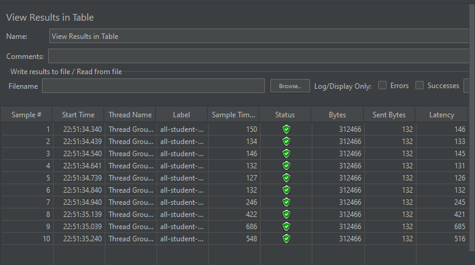
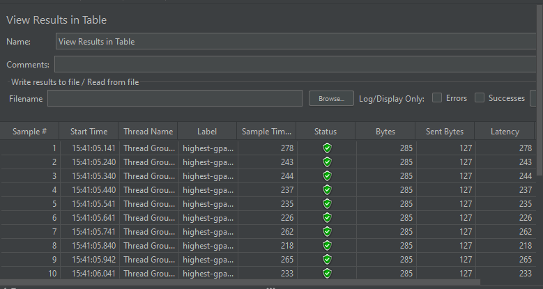
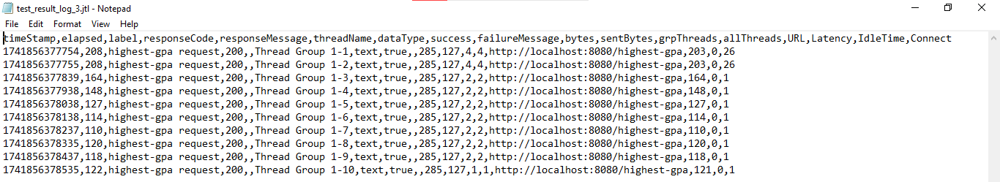
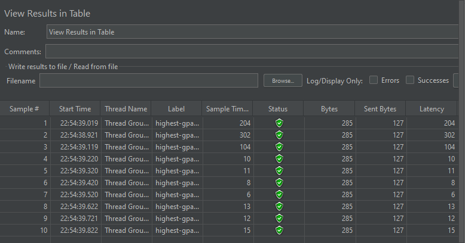

<h1>Pemrograman Lanjut</h1>

<h2>
   
   Nama  : Muhammad Akmal Abdul Halim
   
   NPM   : 2306245125
  
   Kelas : B
  
</h2>

------------------------------------------------------------------------------------------------------------------------------------------------------------------------------------------

  
 Tutorial 5 

<h3>All Student</h3>

**Sebelum Optimization**

**Setelah Optimization method getAllStudentWithCourse**

<h3>All Student Name</h3>

**Sebelum Optimization**

**Setelah Optimization method joinStudentNames**

<h3>Highest GPA</h3>

**Sebelum Optimization**

**Setelah Optimization method findStudentWithHighestGpa**

------------------------
<h3>Conclusion</h3>

Seperti yang terlihat dari gambar, setelah saya melakukan optimisasi untuk setiap endpoint yang terkait. Bahwa terdapat
perubahan yang signifikan,
- All Student : Dari yang awalnya membutuhkan waktu rata-rata ~500000ms menjadi hanya membutuhkan waktu rata-rata ~2000 ms. Terdapat improvement sebesar 99.6%.
- All Student Name : Dari yang awalnya membutuhkan waktu rata-rata ~10000ms menjadi hanya membutuhkan waktu rata-rata ~272 ms. Terdapat improvement sebesar 97.28%.
- Highest GPA : Dari yang awalnya membutuhkan waktu rata-rata ~200ms menjadi hanya membutuhkan waktu rata-rata ~58 ms. Terdapat improvement sebesar 71%.

-----
<h3>Reflection</h3>

1. What is the difference between the approach of performance testing with JMeter and profiling with IntelliJ Profiler in the context of optimizing application performance?

   - JMeter: Digunakan untuk melakukan performance testing dari sisi eksternal. Kita mensimulasikan beban nyata (jumlah pengguna, permintaan bersamaan, dsb.) dan melihat bagaimana aplikasi merespons (waktu respons, throughput, dsb.). Ini membantu mengukur end-to-end performance dari sudut pandang pengguna.
   - IntelliJ Profiler: Digunakan untuk profiling dari sisi internal. Kita menganalisis bagaimana aplikasi mengalokasikan memori, berapa lama waktu eksekusi setiap metode, dan pemakaian CPU. Ini membantu mengidentifikasi bottleneck atau kode yang paling boros sumber daya di dalam aplikasi itu sendiri.
   
   Dengan kata lain, JMeter memberi gambaran “seberapa cepat aplikasi berlari” dalam kondisi beban tertentu, sedangkan IntelliJ Profiler menjelaskan “di bagian mana kode kita lambat” dan “mengapa itu lambat.”

2. How does the profiling process help you in identifying and understanding the weak points in your application?

   Profiling secara real-time mengukur berbagai metrik seperti penggunaan CPU, memori, alokasi objek, dan waktu eksekusi per baris atau per metode. Dari hasil ini, kita bisa melihat:
    - Metode atau blok kode mana yang paling sering dipanggil.
    - Bagian mana yang paling banyak memakan waktu (hotspot CPU).
    - Bagian mana yang paling banyak mengalokasikan objek (berpotensi menimbulkan garbage collection sering).
    
   Dengan data detail tersebut, kita dapat menelusuri lebih dalam mengapa kinerja lambat dan fokus memperbaiki bagian yang paling berpengaruh (hotspot).
3. Do you think IntelliJ Profiler is effective in assisting you to analyze and identify bottlenecks in your application code?

   Ya, IntelliJ Profiler sangat efektif karena:
    - Memberikan visual representation dari call stack dan alokasi memori.
    - Memudahkan navigasi ke baris kode yang paling sering memakan waktu eksekusi.
    - Integrasi langsung dengan IntelliJ membuat alur kerja debugging kinerja lebih lancar.
    
   Secara keseluruhan, IntelliJ Profiler membantu kita lebih cepat menemukan dan memahami penyebab bottleneck dibanding sekadar menebak dari log atau hasil end-to-end testing.
4. What are the main challenges you face when conducting performance testing and profiling, and how do you overcome these challenges?

    Tantangan yang saya hadapi ketika melakukan performance testing dan profiling adalah ketika saya mencerna informasi yang diberikan JMeter dan IntelliJ Profiler.
    Banyaknya informasi yang diberikan menyulitkan saya untuk mengerti apa yang sedang terjadi. Maka dari itu hal yang saya lakukan adalah mempelajari lebih dalam fitur-fitur
    dan informasi-informasi yang diberikan. Saya juga menghadapi tantangan dimana hasil dari testing tidak konsisten. Oleh sebab itu, saya melakukan testing berulang kali untuk memastikan hasilnya stabil.
5. What are the main benefits you gain from using IntelliJ Profiler for profiling your application code?

   - Insight terperinci: Memperlihatkan metode mana yang paling lama dieksekusi, objek mana yang paling banyak dialokasikan.
   - Integrasi IDE: Langsung melihat hasil profiling di IntelliJ, mudah melompat ke baris kode terkait.
   - Menghemat waktu: Lebih cepat menemukan akar masalah performa dibanding trial-and-error manual.
   - Visual: Grafik dan laporan memudahkan interpretasi data, sehingga pengembang bisa segera fokus pada titik paling bermasalah.

6. How do you handle situations where the results from profiling with IntelliJ Profiler are not entirely consistent with findings from performance testing using JMeter?

    Jika ada perbedaan dalam hasil testing, saya melakukan tes ulang untuk memastikan hasil yang konsisten muncul dari tes-tes yang saya lakukan sambil memastikan kondisi yang sama persis disetiap tes yang saya lakukan.
    Setelah itu, saya analisis lagi dari hasil yang saya dapatkan dan baru menentukan implementasi yang baiknya gimana. 
7. What strategies do you implement in optimizing application code after analyzing results from performance testing and profiling? How do you ensure the changes you make do not affect the application's functionality?

   - Fokus pada hotspot: Prioritaskan perbaikan di metode atau query yang paling banyak memakan waktu.
   - Perbaiki algoritma/data structure: Jika profiling menunjukkan kompleksitas tinggi, pertimbangkan algoritma lebih efisien (misal mengganti loop bersarang dengan struktur data lebih optimal).
   - Kurangi query berulang: Misal, atasi N+1 query problem dengan join fetch atau batching.
   - Caching: Jika ada data yang sering diakses tapi jarang berubah, caching dapat membantu.
   - Lakukan regression test: Setelah perubahan, jalankan lagi test fungsional untuk memastikan tidak ada perilaku yang rusak.
   - Iteratif: Profiling, optimasi, uji ulang. Jangan lakukan optimasi besar-besaran sekaligus—lakukan bertahap sambil memverifikasi dampaknya.

